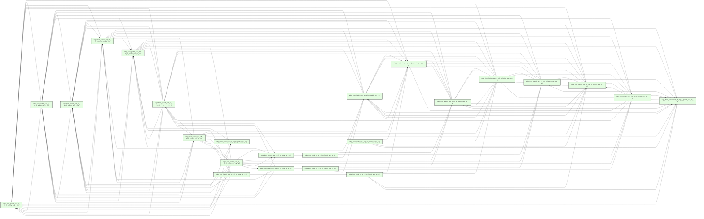

```mermaid
graph LR
%% Терминал

%% Коммутаторы

%% Узлы-ребра
	7["edge_from_[switch_sw1_1_+K]_to_[switch_sw2_2_-K]"]:::edgenode
	8["edge_from_[switch_sw1_2_-K]_to_[switch_sw2_1_+K]"]:::edgenode
	9["edge_from_[switch_sw1_9_+K]_to_[switch_sw2_10_-K]"]:::edgenode
	10["edge_from_[switch_sw1_10_-K]_to_[switch_sw2_9_+K]"]:::edgenode
	11["edge_from_[switch_sw1_17_+K]_to_[switch_sw2_18_-K]"]:::edgenode
	12["edge_from_[switch_sw1_18_-K]_to_[switch_sw2_17_+K]"]:::edgenode
	13["edge_from_[switch_sw1_25_+K]_to_[switch_sw2_26_-K]"]:::edgenode
	14["edge_from_[switch_sw1_26_-K]_to_[switch_sw2_25_+K]"]:::edgenode
	15["edge_from_[switch_sw1_3_+Z]_to_[node_n1_1_+K]"]:::edgenode
	16["edge_from_[switch_sw1_11_+Z]_to_[node_n2_1_+K]"]:::edgenode
	17["edge_from_[switch_sw2_1_+K]_to_[switch_sw1_2_-K]"]:::edgenode
	18["edge_from_[switch_sw2_2_-K]_to_[switch_sw1_1_+K]"]:::edgenode
	19["edge_from_[switch_sw2_9_+K]_to_[switch_sw1_10_-K]"]:::edgenode
	20["edge_from_[switch_sw2_10_-K]_to_[switch_sw1_9_+K]"]:::edgenode
	21["edge_from_[switch_sw2_17_+K]_to_[switch_sw1_18_-K]"]:::edgenode
	22["edge_from_[switch_sw2_18_-K]_to_[switch_sw1_17_+K]"]:::edgenode
	23["edge_from_[switch_sw2_25_+K]_to_[switch_sw1_26_-K]"]:::edgenode
	24["edge_from_[switch_sw2_26_-K]_to_[switch_sw1_25_+K]"]:::edgenode
	25["edge_from_[switch_sw2_3_+Z]_to_[node_n3_1_+K]"]:::edgenode
	26["edge_from_[switch_sw2_11_+Z]_to_[node_n4_1_+K]"]:::edgenode
	27["edge_from_[node_n1_1_+K]_to_[switch_sw1_3_+Z]"]:::edgenode
	28["edge_from_[node_n2_1_+K]_to_[switch_sw1_11_+Z]"]:::edgenode
	29["edge_from_[node_n3_1_+K]_to_[switch_sw2_3_+Z]"]:::edgenode
	30["edge_from_[node_n4_1_+K]_to_[switch_sw2_11_+Z]"]:::edgenode

%% Ребры графа
	7 ---> 17
	7 ---> 19
	7 ---> 21
	7 ---> 23
	8 ---> 17
	8 ---> 18
	8 ---> 19
	8 ---> 20
	8 ---> 21
	8 ---> 22
	8 ---> 23
	8 ---> 24
	8 ---> 25
	8 ---> 26
	9 ---> 17
	9 ---> 19
	9 ---> 21
	9 ---> 23
	10 ---> 17
	10 ---> 18
	10 ---> 19
	10 ---> 20
	10 ---> 21
	10 ---> 22
	10 ---> 23
	10 ---> 24
	10 ---> 25
	10 ---> 26
	11 ---> 17
	11 ---> 19
	11 ---> 21
	11 ---> 23
	12 ---> 17
	12 ---> 18
	12 ---> 19
	12 ---> 20
	12 ---> 21
	12 ---> 22
	12 ---> 23
	12 ---> 24
	12 ---> 25
	12 ---> 26
	13 ---> 17
	13 ---> 19
	13 ---> 21
	13 ---> 23
	14 ---> 17
	14 ---> 18
	14 ---> 19
	14 ---> 20
	14 ---> 21
	14 ---> 22
	14 ---> 23
	14 ---> 24
	14 ---> 25
	14 ---> 26
	15 ---> 27
	16 ---> 28
	17 ---> 9
	17 ---> 11
	17 ---> 13
	17 ---> 7
	18 ---> 7
	18 ---> 8
	18 ---> 9
	18 ---> 10
	18 ---> 11
	18 ---> 12
	18 ---> 13
	18 ---> 14
	18 ---> 15
	18 ---> 16
	19 ---> 9
	19 ---> 11
	19 ---> 13
	19 ---> 7
	20 ---> 7
	20 ---> 8
	20 ---> 9
	20 ---> 10
	20 ---> 11
	20 ---> 12
	20 ---> 13
	20 ---> 14
	20 ---> 15
	20 ---> 16
	21 ---> 9
	21 ---> 11
	21 ---> 13
	21 ---> 7
	22 ---> 7
	22 ---> 8
	22 ---> 9
	22 ---> 10
	22 ---> 11
	22 ---> 12
	22 ---> 13
	22 ---> 14
	22 ---> 15
	22 ---> 16
	23 ---> 9
	23 ---> 11
	23 ---> 13
	23 ---> 7
	24 ---> 7
	24 ---> 8
	24 ---> 9
	24 ---> 10
	24 ---> 11
	24 ---> 12
	24 ---> 13
	24 ---> 14
	24 ---> 15
	24 ---> 16
	25 ---> 29
	26 ---> 30
	27 ---> 9
	27 ---> 11
	27 ---> 13
	27 ---> 7
	28 ---> 9
	28 ---> 11
	28 ---> 13
	28 ---> 7
	29 ---> 17
	29 ---> 19
	29 ---> 21
	29 ---> 23
	30 ---> 17
	30 ---> 19
	30 ---> 21
	30 ---> 23

        
classDef terminal fill:#F45B69,stroke:#333,stroke-width:2px
        classDef switch fill:#688EB6,stroke:#333,stroke-width:2px
        classDef edgenode fill:#E4FDE1,stroke:#333,stroke-width:2px
```
